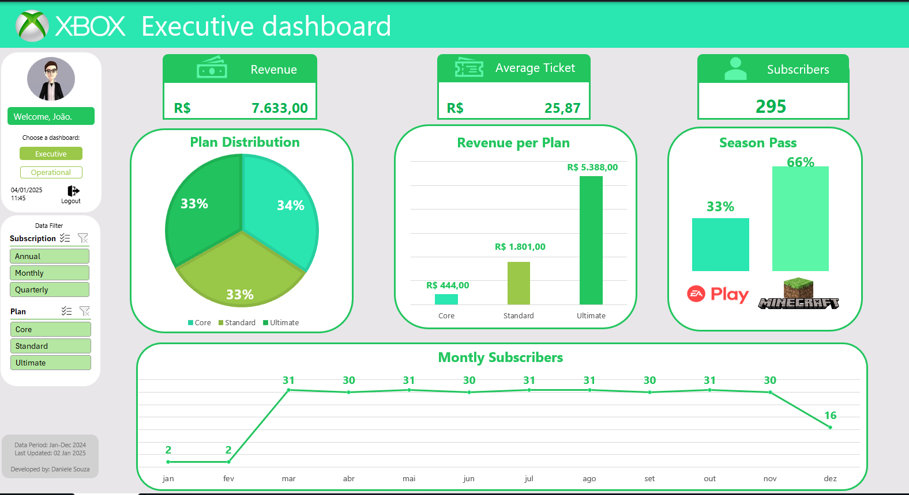

# 📊 Dashboard no Excel

---

## 🧩 Visão Geral
Este projeto apresenta um dashboard executivo desenvolvido no Excel para análise de desempenho de assinaturas da plataforma Xbox. Ele foi criado com foco em visualização clara, tomada de decisão rápida e monitoramento de métricas-chave ao longo do ano de 2024.

_Atenção: Os dados utilizados para este projeto são ficticios e foram fornecidos como parte do Bootcamp Santander e DIO com foco em Ciência de dados com Python._

---

## 📌 Sobre o Projeto

Este repositório contém um dashboard completo feito no **Microsoft Excel**, com segmentações de dados, painéis de indicadores e visualizações que permitem explorar informações de forma dinâmica.

O objetivo do projeto é demonstrar a habilidade em:
- Modelagem e tratamento de dados no Excel
- Construção de dashboards interativos com segmentadores
- Uso de fórmulas, gráficos e KPIs
- Organização de informações relevantes para tomada de decisões

---

## 📁 Conteúdo do Repositório

| Arquivo | Descrição |
|---------|-----------|
| `Dashboard_vF.xlsx` | Arquivo principal com o dashboard pronto para uso |
| `Dashboard_VisaoFinal.png` | Imagem da visão final do dashboard |
| `Dashboard_Video.mp4` | Vídeo de demonstração do dashboard em ação |
| `.gitignore` | Arquivos/pastas ignorados pelo Git |
| `LICENSE` | Licença do projeto (MIT) |

---

## 🚀 Visualização do Dashboard

📹 Vídeo de demonstração:

*(veja o arquivo `Dashboard_Video.mp4` no repositório para entender como os dados e filtros interagem em tempo real.)*

---

## 📌 Como Usar o Dashboard

1. Baixe o arquivo `Dashboard_vF.xlsx`.
2. Abra no **Microsoft Excel** (recomenda-se versão 2016 ou superior).
3. Navegue entre as abas e explore os filtros/slicers.
4. Interaja com os segmentadores para filtrar os dados e observar mudanças dinâmicas nos gráficos e indicadores.

---

## 🛠️ Funcionalidades

O dashboard contém:
- Filtros segmentados para diferentes dimensões;
- Indicadores principais (KPIs) atualizados conforme seleção;
- Gráficos e tabelas dinâmicas;
- Layout visual organizado para facilitar a leitura e tomada de decisão.

---

## 📌 Ferramentas Usadas

Esse projeto foi construído utilizando:
- **Microsoft Excel** (versão recomendada: 2016 ou superior)
- Tabelas Dinâmicas e Segmentadores
- Gráficos nativos do Excel

---

## 📝 Licença

Este projeto está licenciando sob a licença **MIT** — consulte o arquivo `LICENSE` para mais detalhes.

---

## 👩‍💻 Sobre a Autora

**Daniele Souza**  
📍 Conversational AI Developer e Data Analyst & BI Practitioner  
📌 GitHub: https://github.com/danielepsouza  
📌 LinkedIn: [*(Daniele Souza)*](https://www.linkedin.com/in/daniele-pereira-de-souza-7523a4189/)

---

